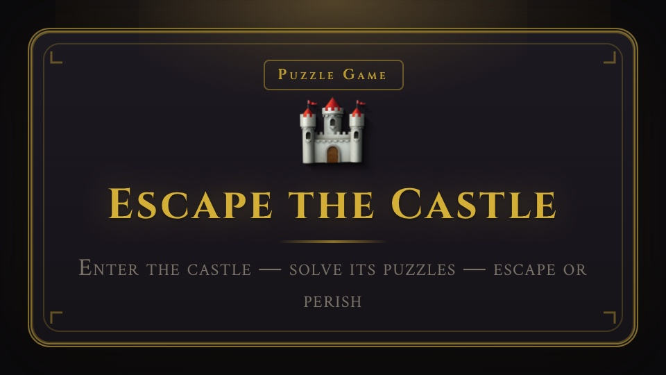

# Escape the Castle

<p align="center">
  
</p>

Multiplayer puzzle race: 15 castle rooms, one puzzle per room. First to escape wins. Real-time leaderboard.

- **Frontend:** React (Vite) — room view, puzzles, leaderboard, WebSocket updates
- **Backend:** Python (FastAPI) — create/join game, advance room, leaderboard, WebSocket broadcast
- **Data:** All game and player state is stored in **SQLite on the server**. Nothing sensitive is kept in the browser.
- **License:** Apache 2.0 — see [LICENSE](LICENSE)
- **Assets:** All images/audio are CC-licensed — see [ASSETS.md](ASSETS.md)

## Quick start

### Backend (Python)

```bash
cd escape-the-castle/backend
./install.sh
source .venv/bin/activate   # Windows: .venv\Scripts\activate
uvicorn main:app --reload --port 8000
```

If `pip install` fails (e.g. SSL/certificate error), use the install script above (it uses trusted hosts), or run manually:

```bash
python3 -m venv .venv
source .venv/bin/activate
pip install --trusted-host pypi.org --trusted-host files.pythonhosted.org -r requirements.txt
uvicorn main:app --reload --port 8000
```

### Frontend (React)

```bash
cd escape-the-castle/frontend
npm install
npm run dev
```

Open http://localhost:5173 — create a game, share the code, start game. Second player joins with the same code and starts. Solve puzzles to advance; leaderboard updates in real time.

## Flow

1. **Home** — Create game (get game code) or Join game (enter code + name).
2. **Lobby** — See players; "Start Game" when ready.
3. **Game** — Current room; click to open puzzle. Solve to advance. Sidebar shows leaderboard. First to complete all 15 rooms wins.
4. **Congratulations** — Redirects to congrats page with final rank.

## Rooms (15)

| Room | Puzzle type |
|------|-------------|
| 0 Entrance Hall | Torch/key |
| 1 Library | Book clue |
| 2 Kitchen | Sequence |
| 3 Dungeon | Code lock |
| 4 Throne Room | Throne game |
| 5 Armory | Jigsaw |
| 6 Tower | Tower climb |
| 7 Chapel | Chain rhythm |
| 8 Wine Cellar | Liquid balance |
| 9 Guard Room | Stealth |
| 10 Nursery | Royal lineage |
| 11 Gallery | Royal code |
| 12 Alchemy Lab | Reality shift |
| 13 Bathhouse | Bubble round |
| 14 Stables | Horse race |

## Database (backend)

- **SQLite** file: `backend/castle.db` (created on first run). Override with env `CASTLE_DB_PATH`.
- **Tables:** `games` (game_code, created_at), `players` (player_id, game_code, player_name, current_room, completed_rooms, room_entered_at, finished_at).
- **Clear all games:** `cd backend && python3 clear_games.py`

## API (backend)

- `POST /api/games` — create game (body: `player_name`)
- `POST /api/games/join` — join (body: `game_code`, `player_name`). Same name rejoins resume progress.
- `GET /api/games/{code}` — game state + leaderboard
- `POST /api/games/{code}/players/advance` — advance (body: `player_id`, `room_index`, `puzzle_answer`)
- `POST /api/games/{code}/players/jump` — jump to room via map
- `GET /api/games/{code}/leaderboard` — leaderboard
- `GET /api/rooms` — room definitions
- `WS /ws/games/{code}` — live game/leaderboard updates

## Docker / Podman & Quay

Build and push to [quay.io/gshanmug-quay/escape-the-castle](https://quay.io/repository/gshanmug-quay/escape-the-castle):

```bash
# Build (amd64 for x86_64 hosts)
podman build --platform linux/amd64 -t quay.io/gshanmug-quay/escape-the-castle:latest .

# Login (one-time)
podman login quay.io

# Push
podman push quay.io/gshanmug-quay/escape-the-castle:latest
```

Or use the helper script: `./push-quay.sh [tag]`

**Run the image:**
```bash
podman run -p 8000:8000 quay.io/gshanmug-quay/escape-the-castle:latest
```
Open http://localhost:8000 — backend serves the built frontend.

## OpenShift deployment

Deploy to OCP with a new namespace and public route:

```bash
cd deploy && oc apply -k . && oc rollout status deployment/escape-the-castle -n escape-the-castle

# Get public URL
oc get route escape-the-castle -n escape-the-castle
```

See `deploy/README.md` for details.

## Red Hat Arcade

See [ASSETS.md](ASSETS.md) for asset attribution. All assets are CC-licensed or procedural.
